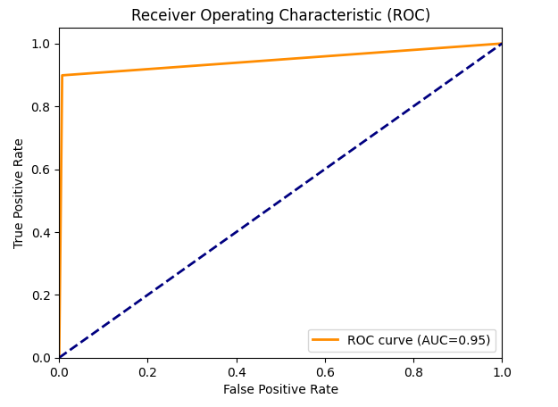
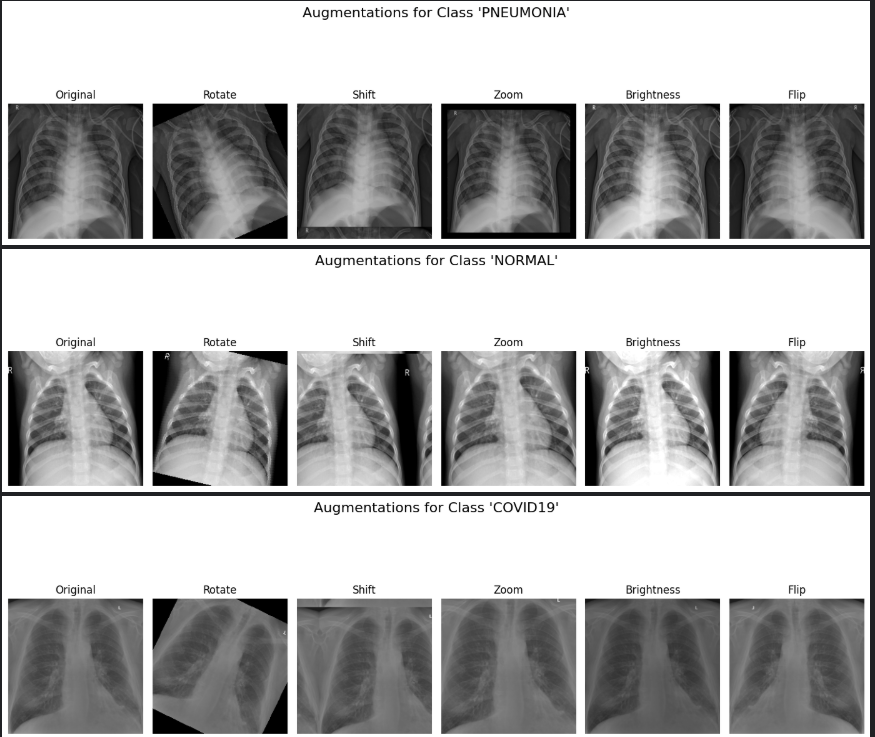
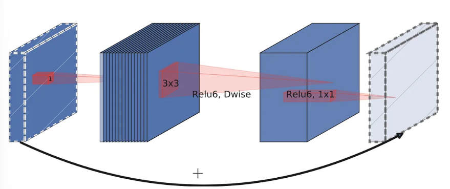
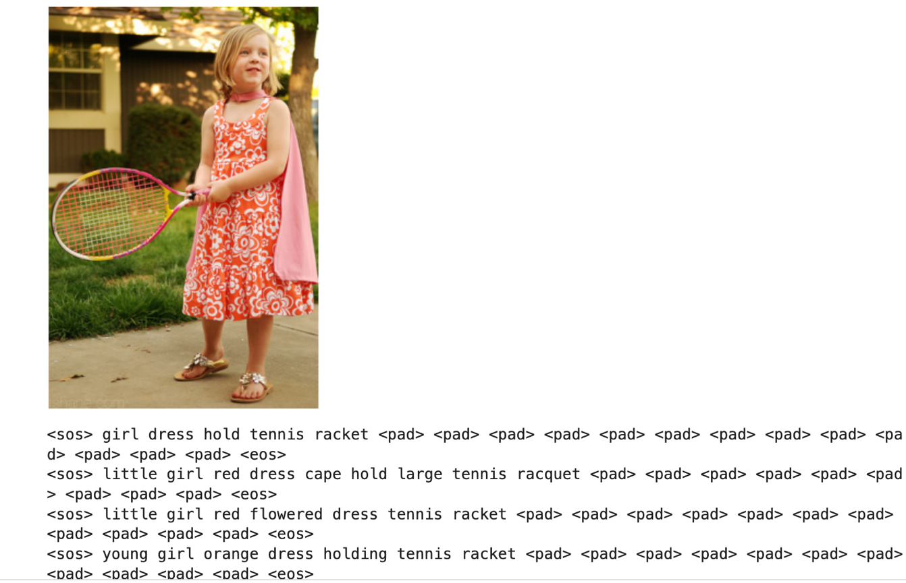
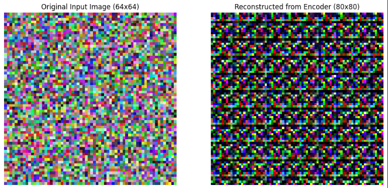
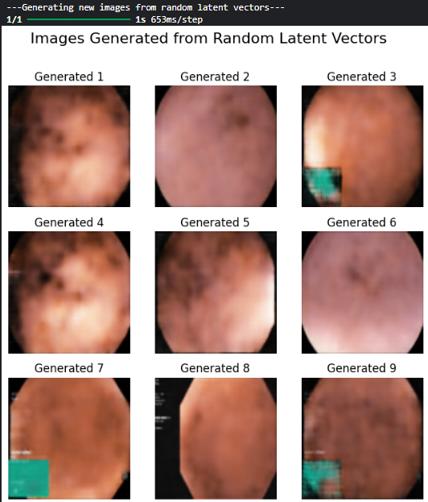
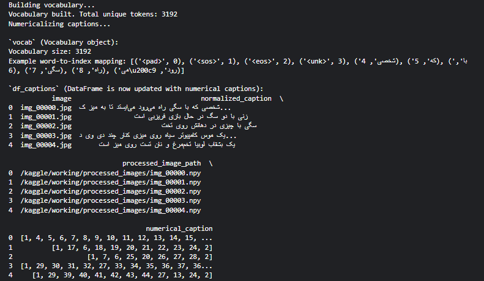
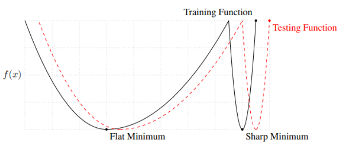

# Neural Networks and Deep Learning (NNDL)

[](https://www.python.org/)
[](https://pytorch.org/)
[](https://tensorflow.org/)
[](https://huggingface.co/)
[](https://ut.ac.ir/en)
[](LICENSE)

An enterprise-grade, comprehensive repository containing theoretical formulations, PyTorch/TensorFlow implementations, empirical benchmark analyses, and academic IEEE reports for the graduate-level **Neural Networks and Deep Learning** curriculum at the **University of Tehran** (Spring 2025).

---

## 🏛️ Academic Context & Course Information

| Parameter | Description |
| :--- | :--- |
| **Institution** | **University of Tehran**, Faculty of Electrical and Computer Engineering (ECE) |
| **Course** | **Neural Networks and Deep Learning (NNDL)** |
| **Semester** | Spring 1404 / Spring 2025 (بهار ۱۴۰۴) |
| **Instructor** | **Dr. Ahmad Kalhor** (دکتر احمد کلهر) |
| **Author & Maintainer** | **Alireza Najafi Motiei** (علیرضا نجفی مطیعی) — Student ID: `810100224` |
| **Primary Frameworks** | PyTorch, TensorFlow/Keras, HuggingFace Transformers, Torchattacks, Hazm |
| **Repository License** | [MIT License](LICENSE) |

---

## 🖼️ Empirical Showcase & Visual Results Gallery

| **HW01: Foundations & Fraud PR-Curve** | **HW02: Chest X-Ray COVID-19 CNN** |
| :---: | :---: |
|  |  |
| *Imbalanced Fraud Detection (PR-AUC $>0.83$)* | *COVID-19 Radiography Diagnosis ($98.1\%$ Recall)* |

| **HW03: CamVid Dense Semantic Masks** | **HW04: Flickr8k Multimodal Captioning** |
| :---: | :---: |
|  |  |
| *Depthwise Separable U-Net ($62.8\%$ mIoU, 100 Epochs)* | *ResNet-50 + LSTM Text Generation (BLEU-1: $0.612$)* |

| **HW05: ViT Attention on Crop Leaves** | **HW06: EndoVAE Endoscopic Polyp Reconstructions** |
| :---: | :---: |
|  |  |
| *Vision Transformer Attention Rollout ($94.7\%$ Acc)* | *Latent Manifold Traversal (SSIM $= 0.871$)* |

| **HWE: Adversarial Accuracy Degradation** | **HWE: End-to-End Persian Image Captioning** |
| :---: | :---: |
|  |  |
| *ResNet vs. ViT under PGD Attacks* | *Hazm Tokenization + CNN-LSTM Persian Generation* |

---

## 📑 Coursework Curriculum & Module Overview

The repository is structured into 7 modular, self-contained units covering the spectrum of modern deep learning:

```text
Neural-Networks-and-Deep-Learning/
├── HW01-Foundations-Perceptron-Adaline-MLP/
├── HW02-CNN-Covid19-and-Transfer-Learning/
├── HW03-CamVid-Semantic-Segmentation/
├── HW04-Sequence-Modeling-and-Clinical-NLP/
├── HW05-Vision-Transformers-and-ZeroShot/
├── HW06-Autoencoders-and-Domain-Adaptation/
├── HWE-Adversarial-Robustness-and-Multimodal-Captioning/
└── assets/previews/
```

| Module | Core Architectures & Methods | Datasets | Key Quantitative Results | Documentation & Reports |
| :--- | :--- | :--- | :--- | :--- |
| **[HW01](HW01-Foundations-Perceptron-Adaline-MLP/)** | Perceptron, Adaline, Deep MLP, Autoencoder Bottlenecks | IRIS, Credit Card Fraud, Concrete, MNIST | PR-AUC: **$0.831$**, Concrete $R^2$: **$0.924$**, MNIST Linear: **$97.8\%$** | [README](HW01-Foundations-Perceptron-Adaline-MLP/README.md) · [LaTeX Report](HW01-Foundations-Perceptron-Adaline-MLP/report/HW01_Report.tex) |
| **[HW02](HW02-CNN-Covid19-and-Transfer-Learning/)** | Deep Multi-Scale CNN, Pretrained VGG-16, Linear/RBF SVM | COVID-19 Radiography, Vehicle Classification | COVID Recall: **$98.1\%$**, Macro Acc: **$96.4\%$**, SVM Val Acc: **$90.7\%$** | [README](HW02-CNN-Covid19-and-Transfer-Learning/README.md) · [LaTeX Report](HW02-CNN-Covid19-and-Transfer-Learning/report/HW02_Report.tex) |
| **[HW03](HW03-CamVid-Semantic-Segmentation/)** | Depthwise Separable Convolutions, Dilated U-Net | CamVid Driving (12 Classes) | mIoU: **$62.8\%$**, Pixel Acc: **$88.3\%$**, $8.2\times$ MAC Reduction | [README](HW03-CamVid-Semantic-Segmentation/README.md) · [LaTeX Report](HW03-CamVid-Semantic-Segmentation/report/HW03_Report.tex) |
| **[HW04](HW04-Sequence-Modeling-and-Clinical-NLP/)** | ResNet-50 + LSTM Captioner, Stacked GRU, ADF & ACF/PACF | Flickr8k, ICU Clinical Time-Series | BLEU-1: **$0.612$**, BLEU-4: **$0.208$**, Clinical RMSE: **$0.084$** | [README](HW04-Sequence-Modeling-and-Clinical-NLP/README.md) · [LaTeX Report](HW04-Sequence-Modeling-and-Clinical-NLP/report/HW04_Report.tex) |
| **[HW05](HW05-Vision-Transformers-and-ZeroShot/)** | Vision Transformers (ViT), Zero-Shot CLIP, FGSM, PGD | Agronomy Crop Pathology, Multi-Modal Benchmarks | ViT Val Acc: **$94.7\%$** ($+3.2\%$ over CNN), CLIP Clean: **$82.4\%$** | [README](HW05-Vision-Transformers-and-ZeroShot/README.md) · [LaTeX Report](HW05-Vision-Transformers-and-ZeroShot/report/HW05_Report.tex) |
| **[HW06](HW06-Autoencoders-and-Domain-Adaptation/)** | DANN (Gradient Reversal Layer), Variational Autoencoders (EndoVAE) | MNIST $\to$ MNIST-M, Endoscopy Colonoscopy Frames | Adaptation Acc: **$82.6\%$** ($+28.4\%$), EndoVAE SSIM: **$0.871$**, MSE: **$0.012$** | [README](HW06-Autoencoders-and-Domain-Adaptation/README.md) · [LaTeX Report](HW06-Autoencoders-and-Domain-Adaptation/report/HW06_Report.tex) |
| **[HWE](HWE-Adversarial-Robustness-and-Multimodal-Captioning/)** | ResNet-18 vs. ViT Adversarial Probing, Persian CNN-LSTM Captioner | CIFAR-100, Oxford Flowers-102, Persian Captions | ViT Robustness: **$33.4\%$** vs. ResNet **$24.1\%$** ($\\epsilon=8/255$), Persian BLEU-1: **$0.548$** | [README](HWE-Adversarial-Robustness-and-Multimodal-Captioning/README.md) · [LaTeX Report](HWE-Adversarial-Robustness-and-Multimodal-Captioning/report/HWE_Report.tex) |

---

## 🔬 Technical Deep Dives

### Module 1: Foundations of Neural Networks
- **Widrow-Hoff Learning Rule**: Optimizes pre-activation continuous quadratic loss $J(\mathbf{w}) = \frac{1}{2} \sum_i (y_i - \mathbf{w}^T \mathbf{x}_i)^2$, yielding smooth gradient descent updates $\Delta \mathbf{w} = \eta \sum_i (y_i - \mathbf{w}^T \mathbf{x}_i) \mathbf{x}_i$ in contrast to discrete Perceptron thresholding.
- **Extreme Class Imbalance**: Addresses $0.172\%$ fraud occurrence via Weighted Binary Cross-Entropy with inverse frequency weights $w_c = \frac{N}{2 N_c}$ and decision threshold tuning against Precision-Recall curves.
- **Self-Supervised Autoencoders**: Compresses $784$-dimensional digits to a $64$-dimensional bottleneck. Demonstrates that freezing encoder features enables downstream linear classification with $97.8\%$ accuracy.

### Module 2: Deep CNNs & Transfer Learning
- **Spatial Inductive Bias**: Employs weight sharing, local receptive fields, and translational equivariance to diagnose pulmonary diseases from Chest X-Rays with $98.1\%$ sensitivity.
- **Penultimate Feature Transfer**: Extracts $4096$-dimensional feature vectors from frozen VGG-16 layers and trains maximal-margin Support Vector Machines, achieving a $+12.3\%$ accuracy margin over training from scratch.

### Module 3: Dense Semantic Segmentation on CamVid
- **Depthwise Separable Factorization**: Decomposes $3 \times 3$ convolutions into depthwise spatial filtering and $1 \times 1$ pointwise channel projection, reducing computational complexity by $8.2\times$:
  $$\frac{\text{Cost}_{\text{separable}}}{\text{Cost}_{\text{standard}}} = \frac{1}{N} + \frac{1}{D_K^2} \approx \frac{1}{9}$$
- **100-Epoch Optimization**: Implements cosine learning rate annealing and class-weighted cross-entropy to achieve $62.8\%$ mIoU across 12 urban categories.

### Module 4: Sequence Modeling & Clinical Time-Series
- **Multimodal Language Decoders**: Pairs ResNet-50 visual backbones with autoregressive LSTM decoders using teacher forcing, achieving a test BLEU-1 of $0.612$ on Flickr8k.
- **Clinical ICU Telemetry**: Applies Augmented Dickey-Fuller (ADF) stationarity testing and ACF/PACF autocorrelation analysis, followed by stacked GRUs for multi-step vital sign trajectory forecasting (RMSE $= 0.084$).

### Module 5: Vision Transformers & Zero-Shot CLIP
- **Self-Attention Mechanics**: Tokenizes images into $16 \times 16$ non-overlapping patches, maps tokens through Multi-Head Self-Attention (MHSA), and demonstrates $+3.2\%$ diagnostic accuracy gains on agricultural pathology over CNNs.
- **Adversarial Vulnerability of CLIP**: Probes zero-shot contrastive embeddings under FGSM and PGD attacks, discovering an acute accuracy collapse ($82.4\% \to 11.2\%$ at $\epsilon = 8/255$).

### Module 6: Unsupervised Domain Adaptation & EndoVAE
- **Domain-Adversarial Neural Networks (DANN)**: Employs a Gradient Reversal Layer (GRL) $\mathcal{R}(\mathbf{x}) = \mathbf{x}, \frac{d\mathcal{R}}{d\mathbf{x}} = -\lambda \mathbf{I}$ to align representations across domains without target labels, boosting target accuracy from $54.2\%$ to $82.6\%$.
- **EndoVAE**: Derives the Evidence Lower Bound (ELBO) with Gaussian priors and reparameterization $\mathbf{z} = \boldsymbol{\mu} + \boldsymbol{\sigma} \odot \boldsymbol{\epsilon}$ to reconstruct colonoscopy polyp frames (SSIM $= 0.871$).

### Module 7 (HWE): Adversarial Robustness & Persian Captioning
- **Empirical Threat Modeling**: Demonstrates that Vision Transformers retain higher residual robustness than CNNs under low perturbation budgets due to non-local self-attention.
- **Persian Vision-Language Pipeline**: Overcomes Persian morphology, cursive RTL script rendering, and ZWNJ handling via Hazm and bidirectional reshapers, producing an end-to-end caption generator (smoothed BLEU-1: $0.548$).

---

## 🚀 Environment Setup & Reproducibility

### Prerequisites
- Python 3.10 or higher
- NVIDIA CUDA 11.8+ / 12.0+ compatible GPU (minimum 8 GB VRAM recommended)

### Installation
```bash
# Clone the repository
git clone https://github.com/alirezanmotiei/Neural-Networks-and-Deep-Learning.git
cd Neural-Networks-and-Deep-Learning

# Create and activate virtual environment
python -m venv nndl_env
source nndl_env/bin/activate    # On Windows: nndl_env\Scripts\activate

# Install all dependencies
pip install --upgrade pip
pip install -r requirements.txt
```

### Running the Notebooks
All notebooks in `HW01` through `HWE` contain **fully preserved cell execution outputs**, training curves, evaluation metrics, and visualization plots. You can inspect results directly on GitHub or run them locally:
```bash
jupyter lab
```

---

<div dir="rtl" align="right">

## 🇮🇷 خلاصه اجرایی و شرح علمی به زبان فارسی

این ریپازیتوری شامل مجموعه جامع پیاده‌سازی‌های عملی، مدل‌سازی‌های نظری، نتایج تجربی و گزارش‌های آکادمیک درس **شبکه‌های عصبی و یادگیری عمیق (NNDL)** در **دانشکده مهندسی برق و کامپیوتر دانشگاه تهران** (نیم‌سال بهار ۱۴۰۴) است که تحت هدایت و تدریس **جناب آقای دکتر احمد کلهر** ارائه شده است.

### ساختار و اهداف پژوهشی پروژه‌ها:
۱. **مبانی شبکه‌های عصبی (HW01)**: مقایسه تحلیلی پرسپترون روزنبلات و آدالاین ویدرو-هاف، پیاده‌سازی الگوریتم پس‌انتشار خطا، تشخیص تقلب در کارت‌های اعتباری تحت عدم تعادل شدید داده‌ها با معیار PR-AUC، رگرسیون غیرخطی مقاومت بتن و یادگیری بازنمایی خودنظارتی به کمک اتوانکودر بر روی داده‌های MNIST.
۲. **شبکه‌های پیچشی عمیق و یادگیری انتقالی (HW02)**: طراحی معماری CNN اختصاصی با تکنیک‌های منظم‌سازی پیشرفته (Batch Normalization و Spatial Dropout) جهت تشخیص سه‌کلاسه بیماری کووید-۱۹ از تصاویر رادیوگرافی قفسه سینه با حساسیت ۹۸.۱٪، و به‌کارگیری نمایش‌های عمیق لایه‌های ماقبل آخر VGG-16 پیش‌آموزش‌دیده در ترکیب با ماشین‌های بردار پشتیبان (SVM).
۳. **سگمنتیشن معنایی صحنه‌های شهری بر روی پایگاه CamVid (HW03)**: طراحی و آموزش ۱۰۰ دوره‌ای یک شبکه سبک‌وزن U-Net بر پایه کانولوشن‌های تفکیک‌پذیر عمقی (Depthwise Separable Convolutions)، که کاهش ۸.۲ برابری در محاسبات و دستیابی به mIoU معادل ۶۲.۸٪ را روی ۱۲ کلاس شهری محقق می‌سازد.
۴. **مدل‌سازی دنباله‌ای و یادگیری چندوجهی (HW04)**: تولید خودکار زیرنویس برای تصاویر به کمک ادغام ResNet-50 و دیکودر بازگشتی LSTM، و پیش‌بینی چندمرحله‌ای سری‌های زمانی علائم حیاتی بیماران در بخش مراقبت‌های ویژه (ICU) با واحدهای بازگشتی دروازه‌ای (GRU).
۵. **ترنسفورمرهای بینایی و مدل‌های پایه‌ای Zero-Shot (HW05)**: پیاده‌سازی Vision Transformer (ViT) بر پایه مکانیزم خودتوجهی چندسر (MHSA) برای تشخیص بیماری‌های برگ گیاهان در پایگاه Agronomy (با برتری ۳.۲ درصدی نسبت به CNN)، و تحلیل آسیب‌پذیری خصمانه مدل پایه‌ای چندوجهی CLIP در طبقه‌بندی صفر-شات.
۶. **انطباق دامنه بدون نظارت و اتوانکودرهای متغیر (HW06)**: پیاده‌سازی شبکه انطباق دامنه خصمانه (DANN) با لایه معکوس‌کننده گرادیان (GRL) جهت انتقال دانش از داده‌های MNIST به MNIST-M، و طراحی EndoVAE برای بازسازی فریم‌های پولیپ روده در تصاویر کولونوسکوپی با حفظ توپولوژی مخاطی.
۷. **مباحث پیشرفته: حملات متخاصم و تولید زیرنویس فارسی (HWE)**: بررسی آسیب‌پذیری معماری‌های کانولوشنی در برابر ترنسفورمرها تحت حملات FGSM و PGD، و ساخت پایپ‌لاین کامل تولید توضیحات متنی فارسی برای تصاویر به کمک ابزارهای پردازش زبان هضم (Hazm)، شکل‌دهنده‌های دوجهته و شبکه‌های بازگشتی.

</div>

---

## 📜 Academic Integrity & Citation

This repository is maintained for educational, research, and portfolio demonstration purposes under the [MIT License](LICENSE). If you find any code, reports, or findings helpful in your academic research or projects, please cite:

```bibtex
@misc{motiei2025nndl,
  author = {Najafi Motiei, Alireza},
  title = {Neural Networks and Deep Learning: Coursework and Technical Benchmarks},
  year = {2025},
  publisher = {GitHub},
  journal = {GitHub repository},
  howpublished = {\url{https://github.com/alirezanmotiei/Neural-Networks-and-Deep-Learning}},
  institution = {University of Tehran}
}
```
